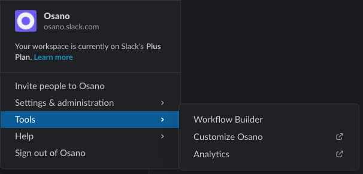
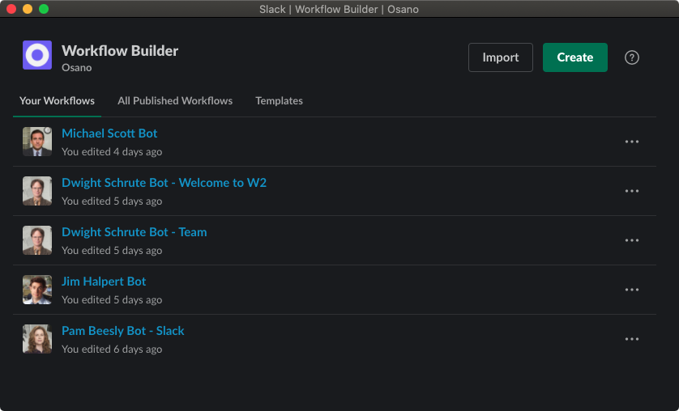

[![Osano][logo]][osano]

![MIT License][li] [![Twitter][ti]][tl]

At Osano we think Slack Workflows are awesome and represent the business operating system of the future. As of now there is no store or repository to find and share these workflows with other enthusiasts, so we made one.

## What are Slack Workflows?

At their core, Slack Workflows are JSON files with a .slackworkflow extension that can be pushed out to users in your company to create powerful interactions, forms, approval workflows and more.

Building Slack Workflows is done in the Workflow Builder and is a point and click way of generating the rules.

## Installation

You can build, export, and import Slack Workflows in your own Slack workspace.

## Contributing

Feel free to upload your Slack Workflow files through a pull request and we'll approve them.

[logo]: contrib/logo.png
[osano]: https://www.osano.com
[li]: https://img.shields.io/badge/license-MIT-brightgreen.svg
[ti]: https://img.shields.io/twitter/url/https/osanoatx.svg?style=social
[tl]: https://twitter.com/osano
